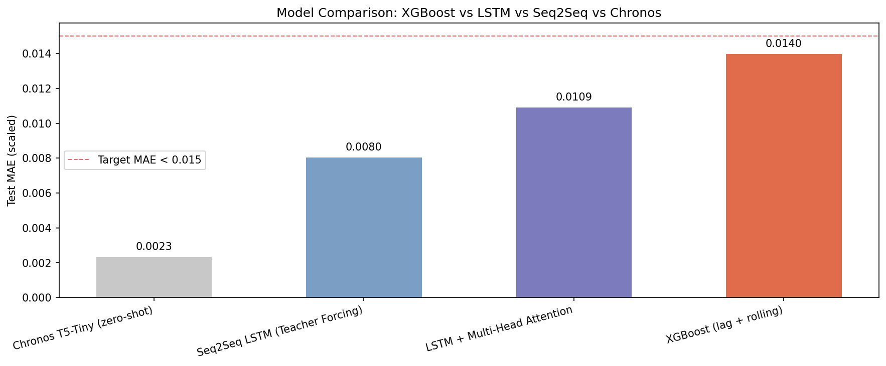
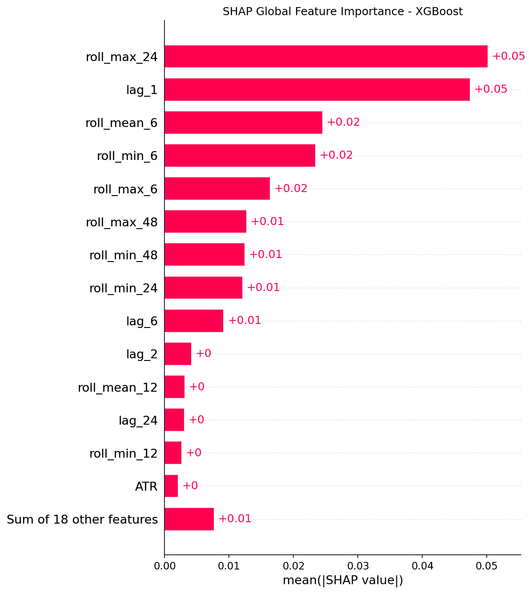

# Bitcoin Hourly Price Forecasting — Multi-Horizon Seq2Seq LSTM with On-Device Core ML Deployment

End-to-end multi-horizon time series forecasting that predicts Bitcoin hourly closing prices 24 hours ahead, built with TensorFlow from low-level primitives — custom Multi-Head Attention, a custom training loop with `tf.GradientTape`, and a Seq2Seq LSTM architecture with teacher forcing.

The model is benchmarked against three independent baselines — XGBoost, a standard LSTM+Attention network, and Amazon's Chronos foundation model (zero-shot) — with experiment tracking via MLflow and feature attribution via SHAP. A separate single-shot variant is exported to **Core ML (`.mlpackage`)** so the same forecasting capability can run on-device on iOS, offline and privacy-preserving.

Originally completed as the final project of **Dicoding's Advanced Deep Learning Project Development** certification (April 2026), then extended with benchmarking, explainability, experiment tracking, and a mobile deployment pipeline.

---

## Results at a Glance

| Model | Test MAE (scaled) | Approach |
|-------|------------------:|----------|
| Chronos T5-Tiny (zero-shot) | **0.0023** | Foundation model, 20M params, no training |
| Seq2Seq LSTM (Teacher Forcing) | **0.0080** | Encoder-decoder, custom training loop |
| LSTM + Multi-Head Attention | 0.0109 | Trained from scratch |
| XGBoost (lag + rolling features) | 0.0140 | Tree ensemble, 500 estimators × 24 |

The custom Seq2Seq model improves on the XGBoost baseline by ~43% and the vanilla LSTM by ~26%. Amazon's Chronos, evaluated zero-shot with no training, outperforms all trained models — a deliberate benchmark that places a bespoke architecture in honest context against a modern foundation model.

---

## Problem Statement

Cryptocurrency price prediction is a challenging multivariate time series problem characterized by high volatility, non-stationary patterns, and complex dependencies between technical indicators. This project tackles **multi-horizon forecasting** — predicting 24 consecutive future values — which is harder than single-step prediction because errors compound across the horizon.

The goal: build a Seq2Seq model that outperforms classical baselines while demonstrating deep understanding of neural network internals through from-scratch implementation, validate it honestly against a foundation model, and deliver a path to on-device deployment.

---

## Dataset

- **Size**: 53,150 hourly records
- **Features (6)**: `Close` (target), `Volume USDT`, `RSI`, `ATR`, plus 24-hour rolling mean and standard deviation of close
- **Target**: next 24 hours of `Close` values
- Loaded directly from a public source inside the notebook — no manual download required

---

## Architecture

### Baseline: LSTM + Multi-Head Attention
```
Input (window_size, 6)
  → LSTM(128, return_sequences=True)
  → CustomDropout(0.2)
  → CustomMultiHeadAttention(d_model=128, heads=4)
  → CustomLayerNorm
  → LSTM(64)
  → CustomDropout(0.2)
  → CustomDense(64, relu)
  → CustomDense(24)
```

### Proposed: Seq2Seq LSTM (Encoder-Decoder with Teacher Forcing)
```
ENCODER:
  Input → LSTM(128) → CustomMultiHeadAttention → CustomLayerNorm → CustomDropout
         └─ encoder states + context

DECODER (autoregressive):
  For each of 24 timesteps:
    LSTMCell(input + prev_output)
      → CustomMultiHeadAttention (cross-attention with encoder)
      → CustomLayerNorm
      → CustomDense(1)
```

Trained with **teacher forcing** (ground truth as next input) and **autoregressive inference** at test time.

---

## Custom Components (Built From Scratch)

Implemented with the TensorFlow low-level API to demonstrate architectural understanding beyond high-level Keras abstractions:

| Component | Purpose |
|-----------|---------|
| `CustomDense` | Linear transformation with manual weight/bias initialization |
| `CustomMultiHeadAttention` | Scaled dot-product attention with multi-head parallelism |
| `CustomDropout` | Stochastic regularization with training/inference modes |
| `CustomLayerNorm` | Per-feature normalization with learnable scale & shift |
| `WeightedMAELoss` | Horizon-weighted MAE (later timesteps weighted higher) |
| `CustomEarlyStopping` / `CustomReduceLR` | Training control callbacks |
| Custom Training Loop | Manual `tf.GradientTape` forward/backward pass |

---

## Benchmarking

Four models are compared on the held-out test set, MAE reported in scaled space (MinMax [0,1]) for direct comparability:

- **XGBoost** — lag features (1–48h), rolling statistics (mean/std/min/max), and cyclical hour/day encoding, with multi-horizon prediction via `MultiOutputRegressor`. A strong, fast, interpretable reference.
- **Chronos (zero-shot)** — Amazon's pretrained Transformer foundation model evaluated without any retraining, contextualizing the value of the custom architecture against a general-purpose forecaster.



---

## Explainability (SHAP)

SHAP attribution applied to the XGBoost baseline to quantify feature contributions, important in a financial domain where decisions must be auditable, not just accurate:

- **Beeswarm** — per-feature impact distribution across predictions
- **Bar** — global feature importance ranking
- **Waterfall** — additive explanation of a single prediction
- **Cross-horizon** — how feature importance shifts from near-term (t+1) to long-term (t+24)



---

## Experiment Tracking (MLflow)

All three trained approaches are logged to MLflow with hyperparameters, metrics, and artifacts for reproducibility and a clear, evidence-based comparison. TensorFlow models with custom layers are logged as `.keras` artifacts to avoid serialization issues.

---

## On-Device Deployment (Core ML)

To bring forecasting to iOS, a production model is built with standard Keras layers in a **single-shot** form (predicting all 24 steps in one forward pass), trained, and converted to Core ML.

- **Why a separate model**: the research Seq2Seq uses custom layers and an autoregressive decoder that do not convert to Core ML. The production model mirrors the architecture with built-in layers, making it convertible and lighter for mobile inference.
- **Conversion path**: Keras Functional model → `coremltools` direct conversion → ML Program (`.mlpackage`), targeting iOS 16. The cuDNN LSTM kernel used during GPU training is bypassed at conversion time by rebuilding the same weights with `unroll=True`, producing Core ML-convertible ops.
- **Preprocessing contract**: `scaler_params.json` exports per-feature min/max so the iOS app can scale inputs and inverse-scale outputs identically to training.

Resulting artifacts: `models/model_production.keras`, `models/BitcoinForecaster.mlpackage`, `models/scaler_params.json`.
Core ML model I/O — input `price_window` `(1, 48, 6)`, output a 24-value forecast tensor.

---

## Repository Structure

```
bitcoin-forecasting/
├── README.md
├── requirements.txt
│
├── notebooks/
│   ├── Research Training DL.ipynb          # research, training & benchmarking
│   └── Model CoreML.ipynb                  # single-shot model + Core ML export
│
├── models/
│   ├── model_baseline_LSTM.keras
│   ├── model_seq2seq_LSTM.keras
│   ├── best_model_seq2seq_LSTM.keras
│   ├── model_production.keras
│   ├── BitcoinForecaster.mlpackage         # Core ML, on-device
│   └── scaler_params.json                  # iOS preprocessing parameters
│
└── assets/
    ├── shap_beeswarm.png
    ├── shap_importance_bar.png
    ├── shap_waterfall.png
    ├── shap_horizon_comparison.png
    └── model_comparison_final.png
```

---

## How to Reproduce

### 1. Clone
```bash
git clone https://github.com/FaizarM/bitcoin-forecasting.git
cd bitcoin-forecasting
```

### 2. Environment
```bash
python -m venv venv
source venv/bin/activate   # Windows: venv\Scripts\activate
pip install -r requirements.txt
```

### 3. Run

**Research & benchmarking** — `notebooks/Research Training DL.ipynb`
Runs the full pipeline: preprocessing, custom Seq2Seq training, XGBoost/Chronos benchmarking, SHAP, and MLflow logging. The Chronos and SHAP cells download a pretrained model and compute attributions; allow extra time on first run.

**Core ML export** — `notebooks/Model CoreML.ipynb`
Self-contained: rebuilds data, trains the single-shot production model, converts to Core ML, and exports the scaler. Best run on a GPU runtime (e.g. Colab T4). Conversion runs on Linux/Colab; the final parity check requires macOS (`MLModel.predict()` is macOS-only).

To view MLflow runs:
```bash
mlflow ui   # http://localhost:5000
```

---

## Tech Stack

- **Deep Learning**: TensorFlow 2.x, Keras
- **Baselines & Benchmarking**: XGBoost, Chronos (Amazon foundation model)
- **Explainability**: SHAP
- **Experiment Tracking**: MLflow
- **Mobile Deployment**: coremltools (Core ML / ML Program)
- **Data & Preprocessing**: NumPy, pandas, scikit-learn
- **Visualization**: Matplotlib, Seaborn
- **Statistics**: statsmodels (ACF/PACF, decomposition)
- **Environment**: Python 3.10+, Jupyter Notebook

---

## Key Learnings

- Implementing Multi-Head Attention from scratch made *"Attention is All You Need"* tangible — Q/K/V projections and scaled dot-product beyond library abstractions.
- Custom training loops with `tf.GradientTape` expose what `model.fit()` does internally, giving fine-grained control over gradients, metrics, and callbacks.
- Benchmarking against XGBoost and a foundation model provides honest context: a strong custom model should be measured against both classical and modern alternatives, not evaluated in isolation. Chronos winning zero-shot is a result worth reporting, not hiding.
- Shipping to Core ML is its own discipline — convertible architectures, op compatibility (the cuDNN/`unroll` issue), and a clean preprocessing contract between Python training and on-device inference.

---

## Author

**Muhammad Fariz Abizar**
Data Science undergraduate @ BINUS University
Associate Data Scientist (BNSP Certified)

- GitHub: [github.com/FaizarM](https://github.com/FaizarM)
- LinkedIn: [linkedin.com/in/fariz-abizar](https://linkedin.com/in/fariz-abizar)

---

*If this project was useful or interesting, a ⭐ is appreciated.*
